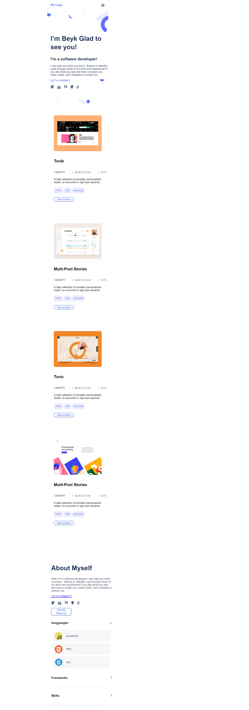

# Portfolio
## About The Project
>Portfolio: mobile and Desktop version with Hamburger button.
## You can see the online version => [See Online](https://beyk.github.io/Portfolio-mobile-version/)

We use Html, Css , Javascript

## Built With
- Html, Html5
- Css, Css3

## Installation
You don't need any special tools to run. you can copy in your local:
git clone https://github.com/beyk/Portfolio-mobile-version.git

## issues page link
Feel free to comment any issue.
[Issues page link](https://github.com/beyk/Portfolio-mobile-version/issues)

## acknowledgement
- Thank you @vickymarz
- @AckonSamuel

## Authors
👤 **Beyk** and **AckonSamuel**
- GitHub: [@beyk](https://github.com/beyk)
- Twitter: [@beyk_a](https://twitter.com/beyk_a)
- LinkedIn: [Beyk](https://www.linkedin.com/in/asghar-beykmohammadi-1b16b291/)

## License

Distributed under the MIT License. See `LICENSE.txt` for more information.

